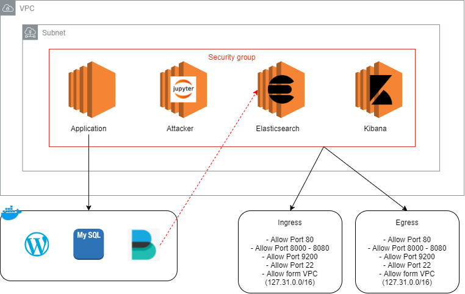

# SOC Workshop LAB 5 "Terraform and Lab Setup"

## How to run this in Cloud9
Step by Step to use this repository
1. Create Cloud9 on AWS
2. Clone this repository by using `git clone https://github.com/SOCWorkshop/Lab-5-SOC-Auto-Terraform.git`
3. Move to the directory using `cd Lab-5-SOC-Auto-Terraform`
4. Execute terraform getting registry using `terraform init`
5. Apply terraform on it using `terraform apply`
6. Enter `yes` as a reply to `terraform apply` in step 5
7. Check the output of terraform as we continue to the next lab

Note (to destroy the lab):
1. Execute `terraform destroy`
2. Answer `yes` as a reply to `terraform destroy`

## Network Design

## Mantainers

  

